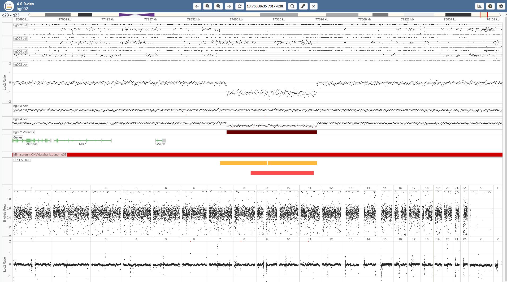

  

## About

**Gens** is a web-based interactive tool to visualize genomic copy number profiles from WGS data. It plots the normalized read depth and alternative allele frequency. It currently does not attempt to visualize breakpoint information. Gens is suitable for visualizing CNVs of sizes down to a couple kb.

This screenshot shows a ~200kb deletion in the GIAB trio. It is present in the mother and proband. 

## Contents

User guide

* [Summary](docs/user_guide/user_summary.md)
* [Tracks view](docs/user_guide/tracks_view.md)
* [Settings](docs/user_guide/settings.md)

Admin guide

- [Installation](docs/admin_guide/installation.md)
- [Load data](docs/admin_guide/load_gens_data.md)
- [Generate input data](docs/admin_guide/generate_gens_data.md)
- [Panel of normals](docs/admin_guide/panel_of_normals.md)
- [Configurations](docs/admin_guide/configure_gens.md)

