# User guide

How to run Gens and interpret the output.

## The samples page

The start page lists all samples found in the database. From here you can open a single sample or an entire case.
A search field helps locating specific entries. Each row includes a link to open the sample in an external software when such
integration is configured.

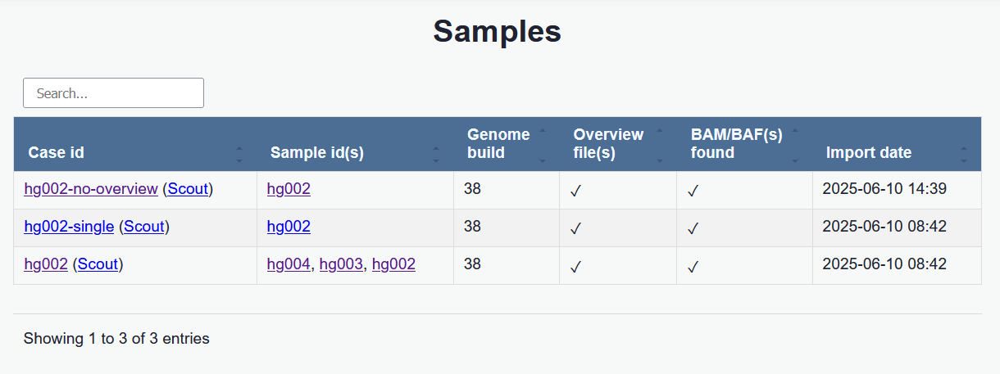

## The sample viewer

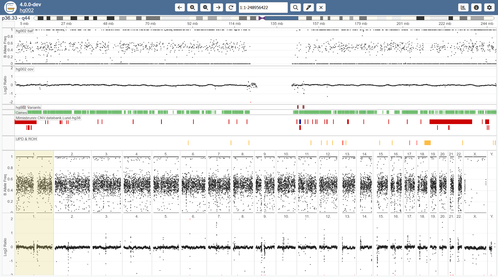

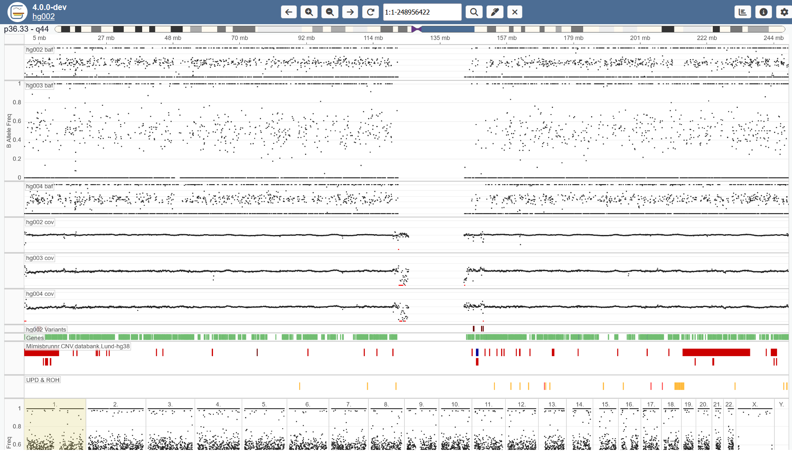

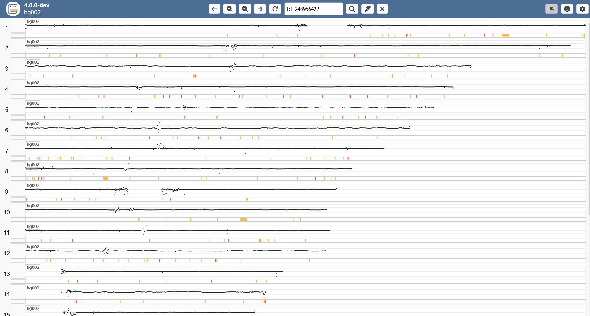

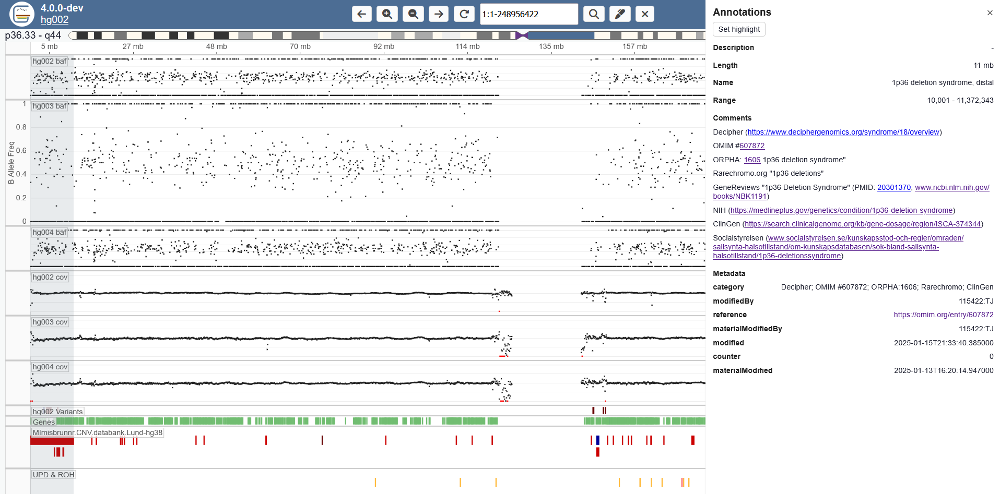

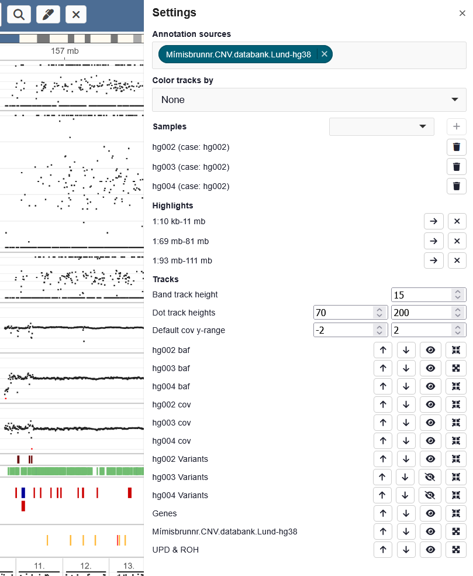

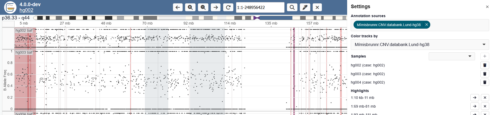

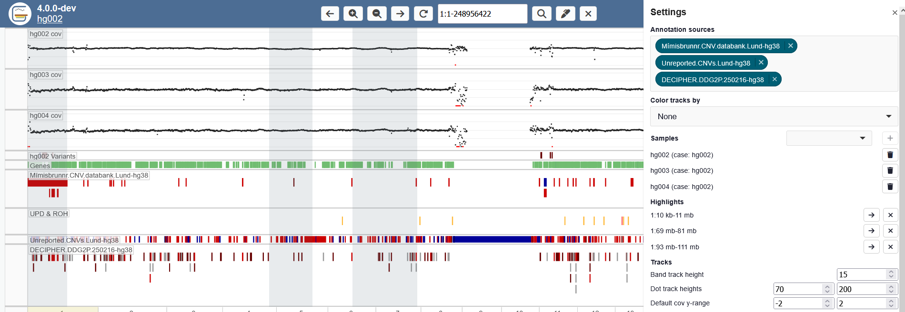

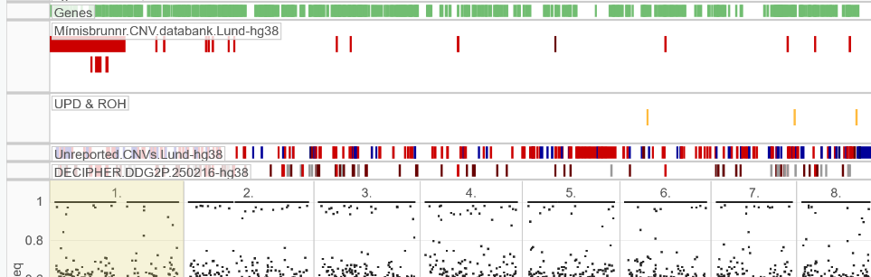

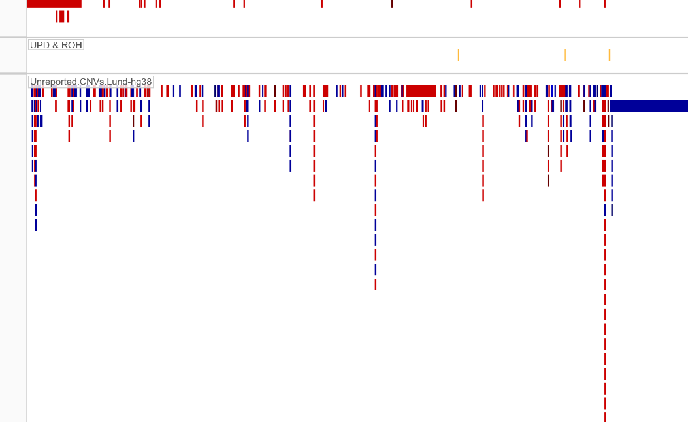

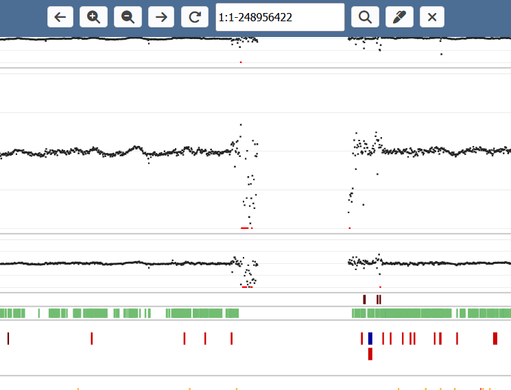

### The track page

#### Tracks

Displayed tracks include log2 coverage ratio, B-allele frequency, genes, variants and optional sample tracks.

An overview row summarises the data and a chromosome track indicates the current position.

Coverage values outside the selected Y-range are drawn in red at the max/min Y-value to highlight extreme values.

#### Track actions

Tracks can be rearranged by dragging the Y-axis. 

Tracks can be expanded by right clicking. For dot-tracks, this simply increases the height of the track. For band tracks,
it expands to show all overlapping bands.

The collapsed / expanded heights of tracks can be configured in the settings menu.

You can zoom using the buttons or the .... shortcuts.
You can pan using the buttons or the .... shortcuts.
You can at any point reset the zoom to the current chromosome using "R" or pressing the "..." icon.

#### Annotation tracks

You can select annotation tracks to display in the settings menu.

<GIF>

You can select one annotation track to color the backgrounds of other tracks.

<GIF>

These settings persist when refreshing the page.

#### Highlighting areas

Highlights can be placed in several way.

1. Enter highlight mode (shortcut M or the pencil button)
2. Click and drag

Highlights can be removed by hovering over and pressing the "X", or by the settings menu.

You can quickly navigate to any highlight through the settings menu.

You can hide tracks though the track menu or the settings page.

You can unhide tracks through the settings page.

Selecting annotations

Color track by annotation

#### Band actions

 * Click to open context menu
 * Set highlight

### The chromosome page

### The meta data view

### Settings menu

 * Annotation sources
 * Color tracks by
 * View, add and remove samples
 * Highlights
 * Track settings
 * Setting persistance
 * Move, show, collapse tracks