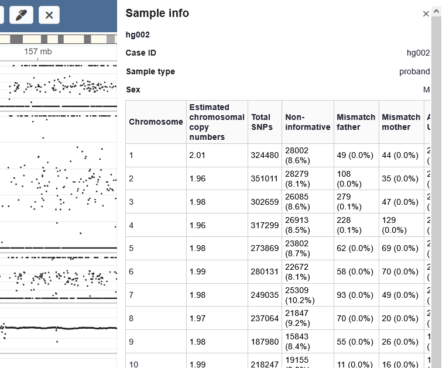

# User guide

* [Samples page](#the-sample-viewer)
* [The sample viewer](#sample-viewer)
    * [Tracks view](#tracks-view)
    * [Settings](#the-settings-page)
    * [Track actions](#track-actions)
    * [Highlights](#highlights)
    * [Chromosome view](#the-chromosome-page)
    * [Meta data](#meta-data)

## The samples page

The start page lists all samples found in the database. From here you can open a single sample or all samples within a case. A search field helps locating specific entries. Each row includes a link to open the sample in an external software when such
integration is configured.

FIXME

* Adding / removing samples
* Change Y-axis range

## Sample viewer

After clicking a sample on the samples page, its tracks are opened in the sample viewer.

### Tracks view

The view of a single sample.

The tracks are:

* hg002 baf: B Allele Frequency
* hg002 cov: Log2 coverage ratio
* hg002 Variants: Filtered SV variants from external software (here from Scout)
* Mimisbrunnr: Annotation track. Multiple annotation tracks can be selected through the settings page (FIXME: see more below)
* UPD & ROH: Custom sample track, here with UPDs and ROHs calculated for the sample outside Gens and loaded together with the sample.

Red dots in the coverage plot are outside the specified Y-range. To not hide this data, they are included in red at the edge of the plot.

When opening a full case, the view is similar, but will display BAF and coverage tracks for all included samples. Variant tracks for non-proband (i.e. mother / father) are available but hidden by default. Then can be shown in the settings menu (FIXME: see below).

Clicking the chromosome tracks button in the top right (dark gray in the screenshot below) opens the chromosome view. Here, coverage information is shown for all chromosomes in the main sample. If additional sample tracks are available, these are shown as well.

Tracks can be expanded by right-clicking on them. For dot-tracks this simply expands the screen size. For band tracks, it expands such that there are no overlaps among the bands.

Clicking any bands in the band tracks opens additional information. Here, a band in the annotation track is clicked.

Clicking the info button in the top right corner opens available meta information for the sample. This is basic information on sample IDs, sample type and sex. If additional meta data has been loaded, this is also shown.

Much of the configurations of Gens can be done through the settings page. More details are shown below (FIXME).

#### The settings page

Multiple annotations can be selected.

The track backgrounds can be colored based on one of the annotation tracks.

 * Annotation sources
 * Color tracks by
 * View, add and remove samples
 * Highlights
 * Track settings
 * Setting persistance
 * Move, show, collapse tracks

#### Track actions

Tracks can be rearranged by dragging the Y-axis. 

Tracks can be expanded by right clicking. For dot-tracks, this simply increases the height of the track. For band tracks,
it expands to show all overlapping bands.

The collapsed / expanded heights of tracks can be configured in the settings menu.

You can zoom using the buttons or the .... shortcuts.
You can pan using the buttons or the .... shortcuts.
You can at any point reset the zoom to the current chromosome using "R" or pressing the "..." icon.

#### Annotation tracks

You can select annotation tracks to display in the settings menu.

<GIF>

You can select one annotation track to color the backgrounds of other tracks.

<GIF>

These settings persist when refreshing the page.

#### Highlights

Highlights can be placed in several way.

1. Enter highlight mode (shortcut M or the pencil button)
2. Click and drag

Highlights can be removed by hovering over and pressing the "X", or by the settings menu.

You can quickly navigate to any highlight through the settings menu.

You can hide tracks though the track menu or the settings page.

You can unhide tracks through the settings page.

Selecting annotations

Color track by annotation

#### Band actions

 * Click to open context menu
 * Set highlight

### Chromosome view

### Meta data

