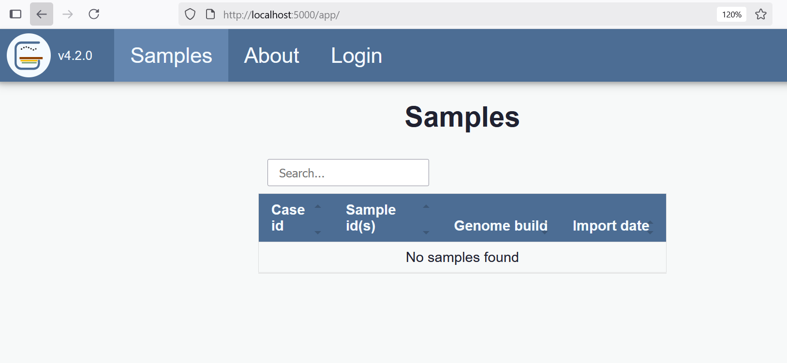

# Setup

## Docker image (recommended)

Using docker, a simple demo and development instance of Gens can be launched with the command `docker compose up -d`.

Gens requires access to a directory where the `xxx.baf.bed.gz` and `xxx.cov.bed.gz` files are stored. This can be achived by mounting the directory. See sample docker-compose below.

```yaml
services:
  gens:
    volumes:
      - /path/to/gens_data:/access/wgs/hg38 # /path/on/host:/path/inside/container
```

The dockerized app consists of 2 containers, the Gens app and a lightweight MongoDB instance.

Once the server has started you can open the app in your web browser at [http://localhost:5000](http://localhost:5000).

To stop the instance use the command `docker-compose down`.

## Local installation

Gens requires Python and MongoDB. It has been tested using Python 3.12. For testing or development purposes the easiest way to install it is to create a virtual environment:

```bash
git clone https://github.com/Clinical-Genomics-Lund/Gens.git
cd Gens
python3 -m venv .venv
source .venv/bin/activate
python -m pip install --upgrade pip
pip install -e .
```

You also need to build the javacript and css files and put them into the directory `gens/static/js` and `gens/static/css` respectively. To build the assets you need to have node installed on your system.

```bash
npm install
# This builds the front-end assets and copies them into the correct locations
npm run buildcp
```

Install MongoDB by following the instructions appropriate for your system. [Here are instructions for Ubuntu](https://www.mongodb.com/docs/v7.0/tutorial/install-mongodb-on-ubuntu/).

You will need to adjust the MongoDB paths in `gens/config.toml` to point to your MongoDB instance. If running it on localhost, the section specifying the dbs will look like the following:

```
[gens_db]
connection = "mongodb://localhost:27017/gens"

[variant_db]
connection = "mongodb://localhost:27017/gens"
```

Start the application using an uvicorn service.

```bash
uvicorn gens.app:create_app --factory --reload --host 0.0.0.0 --port 5000
```

Make sure the application is running by loading http://localhost:5000/ in your web browser. The web app is served at `/` and the API docs are available at http://localhost:5000/api/docs.



Finally you need to populate the databases with chromosome sizes and gene/transcript data (see more under section [Load data](./load_gens_data.md))

## Dev auth providers (LDAP/OAuth)

The development compose file includes seeded LDAP and OAuth providers.

### Start in LDAP mode

```bash
GENS_AUTHENTICATION=ldap docker compose -f docker-compose.yml -f docker-compose.dev.yml up -d
```

Create (or ensure) the login user in Gens auth user DB:

```bash
docker compose -f docker-compose.yml -f docker-compose.dev.yml exec gens \
  gens users create --email dev.user@example.org --name "Dev User" --force
```

Login at `http://localhost:5000/` with:

- email: `dev.user@example.org`
- password: `devpassword`

### Start in OAuth mode (Keycloak)

```bash
GENS_AUTHENTICATION=oauth docker compose -f docker-compose.yml -f docker-compose.dev.yml up -d
```

Create (or ensure) the login user in Gens auth user DB:

```bash
docker compose -f docker-compose.yml -f docker-compose.dev.yml exec gens \
  gens users create --email dev.user@example.org --name "Dev User" --force
```

Open:

- Gens: `http://localhost:5000/`
- Keycloak admin: `http://localhost:5002/` (admin/admin)

Seeded OAuth user credentials:

- username: `dev.user`
- password: `devpass`
- email: `dev.user@example.org`

To use Scout as the login user database instead of Gens, configure `auth_user_db = "variant"` (or `GENS_AUTH_USER_DB=variant`) and make sure that user exists in Scout's `user` collection.
