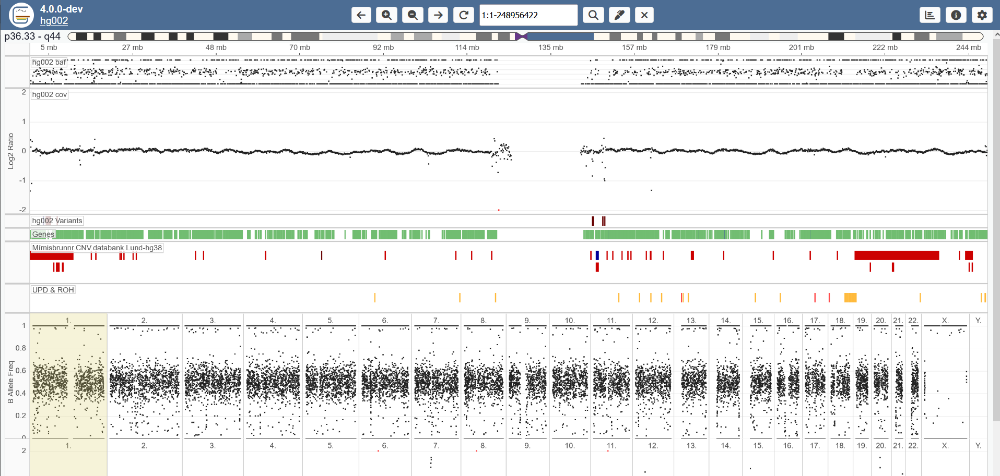
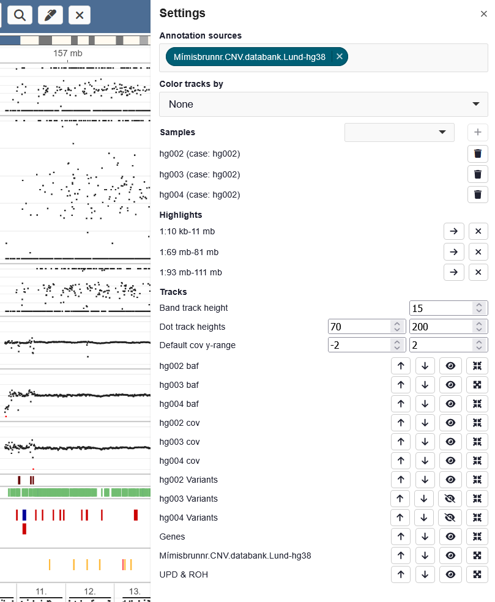
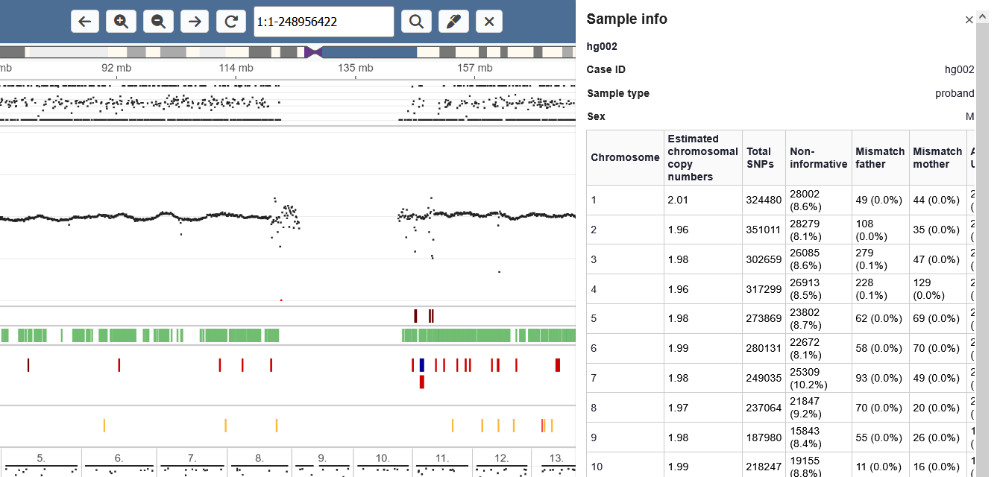

# User guide

When opening Gens consists of a sample page, listing all available samples, and a viewer where tracks can be inspected.

Sample view:

Inside the viewer, the user can either view multiple tracks for one chromosome at a time, or all chromosomes at once.

Track view:

Chromosome view:

In band tracks (annotation, genes, variants, additional sample tracks such as for UPD), the individual bands can be clicked, opening the "band context view" as a side menu.

There are various settings that can be configured. Most are gathered under "settings view". Some track-specific settings can be found by clicking the track labels.

Additional meta data for the case can be seen in the meta data page.

More information on each of these parts is found here:

* [Samples page](./user_guide/samples_page.md)
* [Tracks view](./user_guide/tracks_view.md)
* [Band context view](./user_guide/band_context_view.md)
* [Track actions](./user_guide/track-actions.md)
* [Chromosome view](./user_guide/chromosome_view.md)
* [Settings](./user_guide/settings.md)
* [Meta data](./user_guide/meta-data.md)
