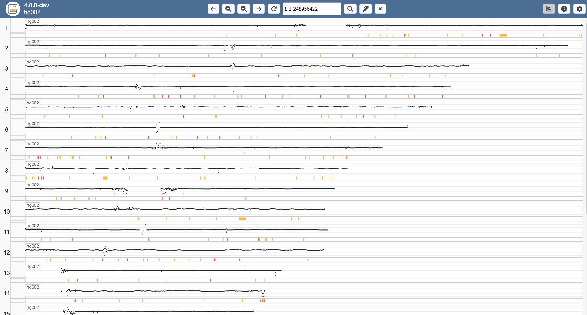

### The chromosome view

The chromosome view shows the log2 coverage ratio per chromosome. It also shows any additional loaded sample tracks (displaying UPD and ROH in the figure below).

It can be opened from the track view by clicking the button to the top right.

Tracks can be expanded by right-clicking on them.
