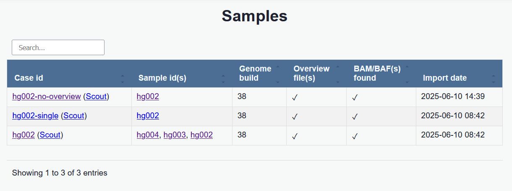

## The samples page

The start page lists all samples found in the database. From here you can open a single sample or all samples within a case. Clicking a sample opens it in the [track view](./tracks_view.md).

A search field helps locating specific samples.

Each row includes a link to open the sample in an external software when such integration is configured.

