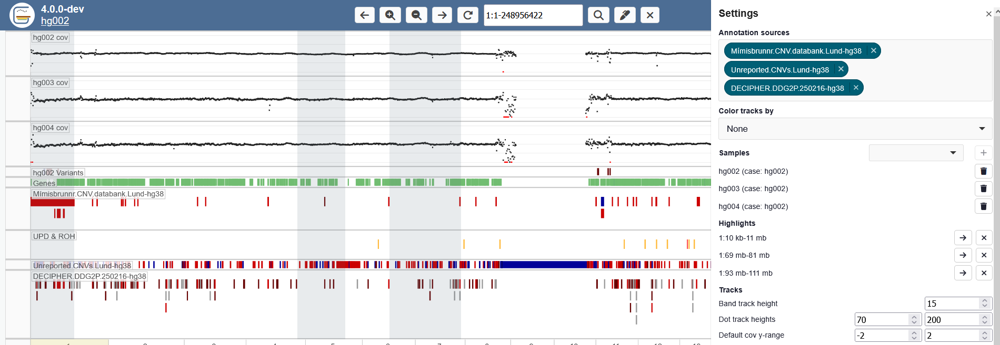
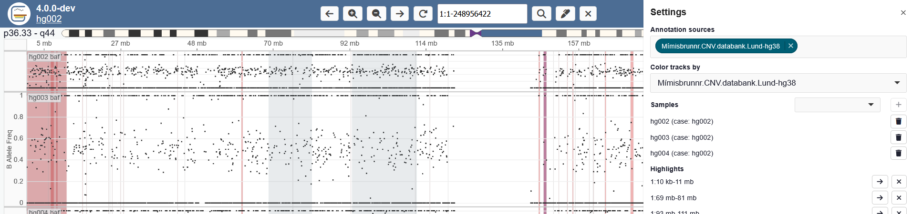

# User settings

User settings can be configured in two locations. In the settings menu:

PNG

And in the track settings:

PNG

Certain settings are persistant across refresh / switching cases (selected annotations and assigned track heights).

 * [Selecting multiple annotations](#selecting-multiple-annotations)
 * [View, add and remove samples](#view-add-and-remove-samples)
 * [Adding, removing and navigating to highlights](#adding-removing-and-navigating-to-highlights)
 * [Changing the Y-axis](#changing-the-y-axis)
 * [Showing and hiding tracks](#showing-and-hiding-tracks)
 * [Moving tracks](#moving-tracks)
 * [Collapsing tracks](#collapsing-tracks)
 * [Highlight tracks by annotation](#highlight-tracks-by-annotation)
 * [Changing heights of tracks](#changing-heights-of-tracks)

## Selecting multiple annotations

Multiple annotations can be selected.

## View, add and remove samples

## Adding, removing and navigating to highlights

## Changing the Y-axis

## Showing and hiding tracks

## Moving tracks

## Collapsing tracks

## Highlight tracks by annotation

The track backgrounds can be colored based on one of the annotation tracks.

## Changing heights of tracks