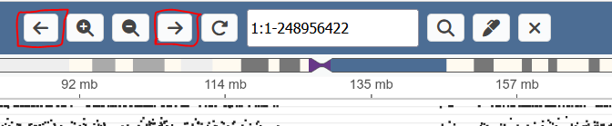

# Tracks view

The tracks view displays information about a single chromosome.

* [Tracks](#tracks)
* [Opening a case](#opening-a-case)
* [Expand / collapse tracks](#expand--collapse-tracks)
* [Open the context menu](#open-the-context-menu)
* [Annotation tracks](#annotation-tracks)
* [Highlights](#highlights)

## Tracks

The default tracks are:

* B allele frequency (BAF).
* Log2 coverage ratio (cov). Dots outside the Y-range are rendered in red at the min/max y-value.
* Gene track showing MANE transcripts.
* Chromosome ideogram (top). You can navigate the chromosome by clicking on any band.
* The overview track (bottom) displaying BAF and cov for all chromosomes. You can navigate to any chromosome by clicking in this track.

Optionally, more tracks can be shown:

* Structural variants. These are retrieved from external software (currently hard-coded to use Scout).
* Global annotation tracks, loaded from bed, tsv or aed. One or more can be selected in the settings menu.
* Sample specific tracks. Below, a track showing UPD and ROH ranges is shown.

## Navigation

You can zoom using the buttons or the up/down arrow keys.

You can also zoom into any area by pressing shift and dragging with the mouse.

[FIXME]

You can pan using the buttons or the left/right arrow keys. You can also press space and drag the mouse to pan.

You can at any point reset the zoom to the current chromosome the button or "R" key.

You can navigate between chromosomes by clicking the overview plot, or pressing control + arrows.

You can also navigate directly to a position by typing out a chromosome + range in the search field and pressing search.

## Opening multiple samples

When opening a full case, the view is similar, but will display BAF and coverage tracks for all included samples. Variant tracks for non-proband (i.e. mother / father) are available but hidden by default. Then can be shown in the settings menu (FIXME: see below).

Additional samples can be included through the settings menu.

## Expand / collapse tracks

Tracks can be expanded by right-clicking on them. For dot-tracks this simply expands the screen size. For band tracks, it expands such that there are no overlaps among the bands.

Tracks can be expanded by right clicking. For dot-tracks, this simply increases the height of the track. For band tracks,
it expands to show all overlapping bands.

The collapsed / expanded heights of tracks can be configured in the settings menu.

[FIXME]

## Open the context menu

Clicking any bands in the band tracks opens additional information. Here, a band in the annotation track is clicked.

## Annotation tracks

You can select annotation tracks to display in the settings menu.

You can select one annotation track to color the backgrounds of other tracks.

These settings persist when refreshing the page.

## Rearrange tracks

Tracks can be rearranged by dragging the Y-axis. 

They can also be rearranged in the settings menu.

## Adjust 

#### Highlights

Highlights lets you mark a region, see it across all tracks and later quickly navigate back to it.

These highlights can be placed in several way.

1. Enter highlight mode (shortcut M or the pencil button)
2. Click and drag

Highlights can be removed by hovering over and pressing the "X", or by the settings menu.

You can quickly navigate to any highlight through the settings menu.

You can hide tracks though the track menu or the settings page.

You can unhide tracks through the settings page.

