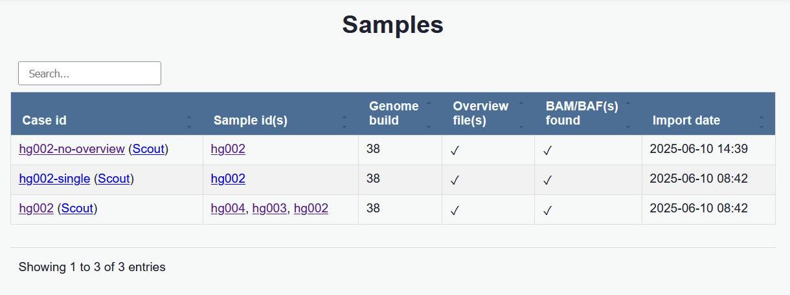
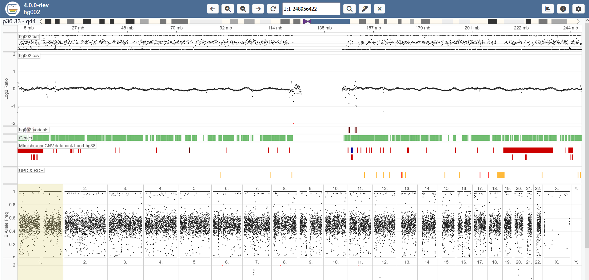
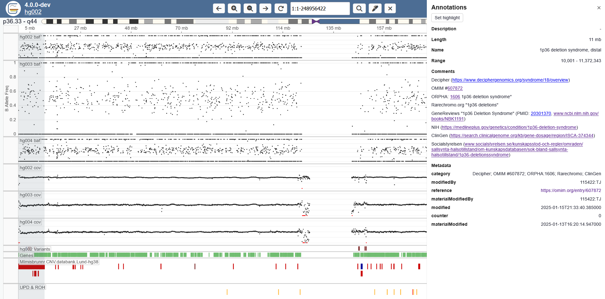
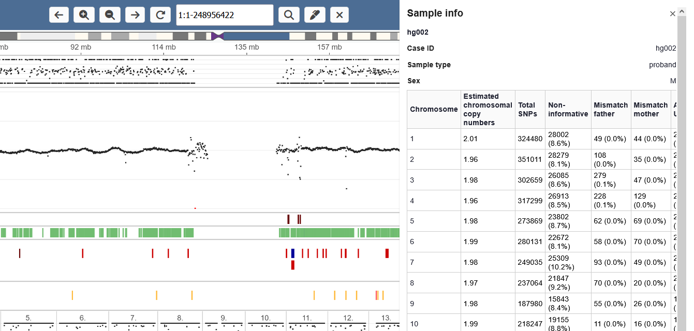

# Quick summary

When open Gens, a list of all available cases is shown. From here, a full case can be opened, or single samples. If set up, links to cases in external software (here: Scout).

Inside the viewer, the user can either view multiple tracks for one chromosome at a time, or all chromosomes at once.

In the track view below chromosome 1 is inspected for a single sample. You see tracks for B allele frequency, coverage, structural variants, genes and additional annotations.

Open the multi-chromosomes view by clicking the chromosomes button:

In band tracks (annotation, genes, variants, additional sample tracks such as for UPD), the individual bands can be clicked, opening the "band context view" as a side menu.

There are various settings that can be configured. Most are gathered under "settings view". Some track-specific settings can be found by clicking the track labels.

Open the settings menu by clicking the settings button:

Additional meta data for the case can be seen in the meta data page.

